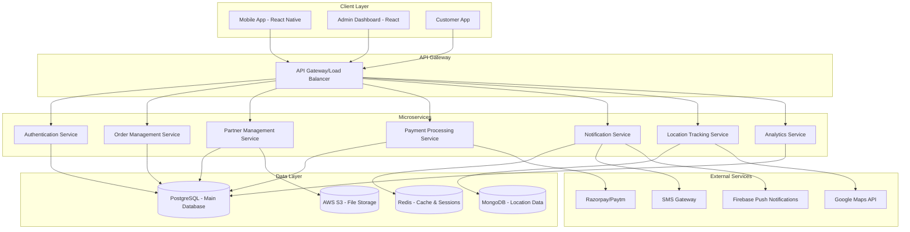

# Delivery Partner Platform - Design Document

## Overview

The Delivery Partner Platform is a comprehensive solution that enables efficient management of grocery deliveries through a mobile-first application for delivery partners and web-based admin controls. The system integrates with the existing Grocito ecosystem to provide seamless order assignment, real-time tracking, payment processing, and performance management.

## Architecture

### System Architecture



### Technology Stack

**Frontend:**
- **Mobile App**: React Native with TypeScript
- **Admin Dashboard**: React.js with TypeScript
- **State Management**: Redux Toolkit
- **Navigation**: React Navigation (Mobile), React Router (Web)
- **UI Components**: Native Base (Mobile), Material-UI (Web)

**Backend:**
- **Runtime**: Node.js with Express.js
- **Language**: TypeScript
- **Database**: PostgreSQL (main), MongoDB (location data)
- **Cache**: Redis
- **File Storage**: AWS S3
- **Real-time**: Socket.io for live tracking

**Infrastructure:**
- **Deployment**: Docker containers on AWS ECS
- **Load Balancer**: AWS Application Load Balancer
- **Monitoring**: AWS CloudWatch, Sentry
- **CI/CD**: GitHub Actions

## Components and Interfaces

### Mobile App Components

#### 1. Authentication Module
```typescript
interface AuthenticationService {
  login(phoneNumber: string, otp: string): Promise<AuthResponse>
  logout(): Promise<void>
  refreshToken(): Promise<string>
  verifyOTP(phoneNumber: string, otp: string): Promise<boolean>
}

interface AuthResponse {
  token: string
  refreshToken: string
  partner: DeliveryPartner
  expiresIn: number
}
```

#### 2. Order Management Module
```typescript
interface OrderManagementService {
  getAssignedOrders(): Promise<Order[]>
  acceptOrder(orderId: string): Promise<OrderResponse>
  rejectOrder(orderId: string, reason: string): Promise<void>
  updateOrderStatus(orderId: string, status: OrderStatus): Promise<Order>
  uploadProofOfDelivery(orderId: string, proof: DeliveryProof): Promise<void>
}

interface Order {
  id: string
  customerId: string
  customerName: string
  customerPhone: string
  pickupAddress: Address
  deliveryAddress: Address
  items: OrderItem[]
  totalAmount: number
  paymentMethod: 'COD' | 'DIGITAL'
  specialInstructions?: string
  estimatedDeliveryTime: Date
  status: OrderStatus
  assignedAt: Date
}

type OrderStatus = 
  | 'ASSIGNED' 
  | 'ACCEPTED' 
  | 'PICKED_UP' 
  | 'OUT_FOR_DELIVERY' 
  | 'DELIVERED' 
  | 'CANCELLED'
```

#### 3. Location Tracking Module
```typescript
interface LocationTrackingService {
  startTracking(): Promise<void>
  stopTracking(): Promise<void>
  getCurrentLocation(): Promise<Location>
  updateLocation(location: Location): Promise<void>
  getOptimizedRoute(destinations: Address[]): Promise<Route>
}

interface Location {
  latitude: number
  longitude: number
  accuracy: number
  timestamp: Date
  address?: string
}

interface Route {
  waypoints: Location[]
  distance: number
  estimatedTime: number
  instructions: string[]
}
```

#### 4. Payment Processing Module
```typescript
interface PaymentService {
  recordCashPayment(orderId: string, amount: number): Promise<PaymentRecord>
  generateDigitalPaymentQR(orderId: string): Promise<QRCodeData>
  verifyDigitalPayment(orderId: string): Promise<PaymentStatus>
  getDailyCollections(): Promise<CashCollection>
  recordCashDeposit(amount: number, location: string): Promise<DepositRecord>
}

interface PaymentRecord {
  orderId: string
  amount: number
  method: 'CASH' | 'UPI' | 'CARD'
  timestamp: Date
  status: 'PENDING' | 'COMPLETED' | 'FAILED'
}
```

### Backend API Interfaces

#### 1. Partner Management API
```typescript
interface PartnerController {
  // Registration and Profile
  POST /api/partners/register
  GET /api/partners/profile
  PUT /api/partners/profile
  POST /api/partners/documents
  
  // Availability Management
  PUT /api/partners/availability
  GET /api/partners/status
  
  // Performance and Earnings
  GET /api/partners/earnings
  GET /api/partners/performance
  GET /api/partners/analytics
}
```

#### 2. Order Assignment API
```typescript
interface OrderAssignmentController {
  // Order Assignment
  POST /api/orders/assign
  GET /api/orders/assigned/:partnerId
  PUT /api/orders/:orderId/accept
  PUT /api/orders/:orderId/reject
  
  // Order Management
  PUT /api/orders/:orderId/status
  POST /api/orders/:orderId/proof
  GET /api/orders/:orderId/details
}
```

#### 3. Real-time Tracking API
```typescript
interface TrackingController {
  // Location Updates
  POST /api/tracking/location
  GET /api/tracking/:orderId/live
  
  // Route Optimization
  POST /api/tracking/optimize-route
  GET /api/tracking/navigation/:orderId
}
```

### Database Schema

#### Enhanced DeliveryPartner Table
```sql
CREATE TABLE delivery_partners (
    id BIGSERIAL PRIMARY KEY,
    full_name VARCHAR(100) NOT NULL,
    phone_number VARCHAR(15) UNIQUE NOT NULL,
    email VARCHAR(100) UNIQUE,
    profile_image_url VARCHAR(500),
    
    -- Vehicle Information
    vehicle_type VARCHAR(50) NOT NULL, -- 'BIKE', 'SCOOTER', 'BICYCLE'
    vehicle_number VARCHAR(20) NOT NULL,
    driving_license VARCHAR(50) NOT NULL,
    
    -- Location and Availability
    assigned_pincode VARCHAR(10) NOT NULL,
    current_latitude DECIMAL(10, 8),
    current_longitude DECIMAL(11, 8),
    is_available BOOLEAN DEFAULT false,
    availability_status VARCHAR(20) DEFAULT 'OFFLINE', -- 'ONLINE', 'BUSY', 'OFFLINE'
    
    -- Performance Metrics
    total_deliveries INTEGER DEFAULT 0,
    successful_deliveries INTEGER DEFAULT 0,
    average_rating DECIMAL(3, 2) DEFAULT 0.0,
    total_earnings DECIMAL(10, 2) DEFAULT 0.0,
    
    -- Account Status
    verification_status VARCHAR(20) DEFAULT 'PENDING', -- 'PENDING', 'VERIFIED', 'REJECTED'
    account_status VARCHAR(20) DEFAULT 'ACTIVE', -- 'ACTIVE', 'SUSPENDED', 'DEACTIVATED'
    
    -- Timestamps
    created_at TIMESTAMP DEFAULT CURRENT_TIMESTAMP,
    updated_at TIMESTAMP DEFAULT CURRENT_TIMESTAMP,
    last_active_at TIMESTAMP
);
```

#### Order Assignment Table
```sql
CREATE TABLE order_assignments (
    id BIGSERIAL PRIMARY KEY,
    order_id BIGINT NOT NULL REFERENCES orders(id),
    partner_id BIGINT NOT NULL REFERENCES delivery_partners(id),
    
    -- Assignment Details
    assigned_at TIMESTAMP DEFAULT CURRENT_TIMESTAMP,
    accepted_at TIMESTAMP,
    rejected_at TIMESTAMP,
    rejection_reason VARCHAR(200),
    
    -- Status Tracking
    status VARCHAR(20) NOT NULL DEFAULT 'ASSIGNED',
    pickup_time TIMESTAMP,
    delivery_time TIMESTAMP,
    
    -- Location Tracking
    pickup_latitude DECIMAL(10, 8),
    pickup_longitude DECIMAL(11, 8),
    delivery_latitude DECIMAL(10, 8),
    delivery_longitude DECIMAL(11, 8),
    
    -- Performance Metrics
    total_distance DECIMAL(8, 2), -- in kilometers
    delivery_duration INTEGER, -- in minutes
    
    UNIQUE(order_id, partner_id)
);
```

#### Location Tracking Table (MongoDB)
```javascript
// MongoDB Collection: location_tracking
{
  _id: ObjectId,
  partnerId: String,
  orderId: String,
  locations: [{
    latitude: Number,
    longitude: Number,
    accuracy: Number,
    timestamp: Date,
    speed: Number, // km/h
    heading: Number // degrees
  }],
  route: {
    startLocation: {
      latitude: Number,
      longitude: Number,
      address: String
    },
    endLocation: {
      latitude: Number,
      longitude: Number,
      address: String
    },
    waypoints: [{
      latitude: Number,
      longitude: Number,
      estimatedArrival: Date
    }],
    totalDistance: Number,
    estimatedDuration: Number
  },
  createdAt: Date,
  updatedAt: Date
}
```

#### Payment Collections Table
```sql
CREATE TABLE payment_collections (
    id BIGSERIAL PRIMARY KEY,
    partner_id BIGINT NOT NULL REFERENCES delivery_partners(id),
    order_id BIGINT NOT NULL REFERENCES orders(id),
    
    -- Payment Details
    amount DECIMAL(10, 2) NOT NULL,
    payment_method VARCHAR(20) NOT NULL, -- 'CASH', 'UPI', 'CARD'
    collection_time TIMESTAMP DEFAULT CURRENT_TIMESTAMP,
    
    -- Cash Management
    cash_deposited BOOLEAN DEFAULT false,
    deposit_time TIMESTAMP,
    deposit_location VARCHAR(200),
    deposit_reference VARCHAR(100),
    
    -- Digital Payment Details
    transaction_id VARCHAR(100),
    payment_gateway VARCHAR(50),
    gateway_response JSONB,
    
    -- Status
    status VARCHAR(20) DEFAULT 'COLLECTED', -- 'COLLECTED', 'DEPOSITED', 'RECONCILED'
    
    created_at TIMESTAMP DEFAULT CURRENT_TIMESTAMP,
    updated_at TIMESTAMP DEFAULT CURRENT_TIMESTAMP
);
```

## Data Models

### Core Data Models

#### DeliveryPartner Model
```typescript
interface DeliveryPartner {
  id: string
  fullName: string
  phoneNumber: string
  email?: string
  profileImageUrl?: string
  
  // Vehicle Information
  vehicleType: 'BIKE' | 'SCOOTER' | 'BICYCLE'
  vehicleNumber: string
  drivingLicense: string
  
  // Location and Availability
  assignedPincode: string
  currentLocation?: Location
  isAvailable: boolean
  availabilityStatus: 'ONLINE' | 'BUSY' | 'OFFLINE'
  
  // Performance Metrics
  totalDeliveries: number
  successfulDeliveries: number
  averageRating: number
  totalEarnings: number
  
  // Account Status
  verificationStatus: 'PENDING' | 'VERIFIED' | 'REJECTED'
  accountStatus: 'ACTIVE' | 'SUSPENDED' | 'DEACTIVATED'
  
  // Timestamps
  createdAt: Date
  updatedAt: Date
  lastActiveAt?: Date
}
```

#### OrderAssignment Model
```typescript
interface OrderAssignment {
  id: string
  orderId: string
  partnerId: string
  
  // Assignment Details
  assignedAt: Date
  acceptedAt?: Date
  rejectedAt?: Date
  rejectionReason?: string
  
  // Status Tracking
  status: OrderStatus
  pickupTime?: Date
  deliveryTime?: Date
  
  // Location Data
  pickupLocation?: Location
  deliveryLocation?: Location
  
  // Performance Metrics
  totalDistance?: number
  deliveryDuration?: number // in minutes
}
```

## Error Handling

### Error Response Format
```typescript
interface ErrorResponse {
  success: false
  error: {
    code: string
    message: string
    details?: any
    timestamp: Date
  }
}

// Common Error Codes
enum ErrorCodes {
  PARTNER_NOT_FOUND = 'PARTNER_NOT_FOUND',
  ORDER_NOT_ASSIGNED = 'ORDER_NOT_ASSIGNED',
  INVALID_ORDER_STATUS = 'INVALID_ORDER_STATUS',
  LOCATION_PERMISSION_DENIED = 'LOCATION_PERMISSION_DENIED',
  PAYMENT_PROCESSING_FAILED = 'PAYMENT_PROCESSING_FAILED',
  NETWORK_ERROR = 'NETWORK_ERROR',
  AUTHENTICATION_FAILED = 'AUTHENTICATION_FAILED'
}
```

### Error Handling Strategy
1. **Network Errors**: Implement retry logic with exponential backoff
2. **Location Errors**: Graceful degradation with manual location entry
3. **Payment Errors**: Clear error messages with retry options
4. **Authentication Errors**: Automatic token refresh with fallback to login
5. **Order Errors**: Real-time sync with admin dashboard for resolution

## Testing Strategy

### Unit Testing
- **Coverage Target**: 90% code coverage
- **Framework**: Jest for backend, React Native Testing Library for mobile
- **Focus Areas**: Business logic, API endpoints, data transformations

### Integration Testing
- **API Testing**: Postman/Newman for automated API testing
- **Database Testing**: Test database transactions and data integrity
- **External Service Testing**: Mock external APIs (Maps, Payment gateways)

### End-to-End Testing
- **Mobile App**: Detox for React Native E2E testing
- **User Flows**: Complete delivery workflow testing
- **Performance Testing**: Load testing for concurrent users

### Security Testing
- **Authentication**: Token validation and session management
- **Data Protection**: Encryption and secure data transmission
- **API Security**: Rate limiting and input validation
- **Mobile Security**: Certificate pinning and secure storage

## Performance Considerations

### Mobile App Performance
- **Offline Capability**: Cache critical data locally
- **Battery Optimization**: Efficient location tracking algorithms
- **Memory Management**: Proper cleanup of resources
- **Network Optimization**: Request batching and compression

### Backend Performance
- **Database Optimization**: Proper indexing and query optimization
- **Caching Strategy**: Redis for session data and frequently accessed information
- **Load Balancing**: Horizontal scaling for high availability
- **Real-time Updates**: Efficient WebSocket connections

### Scalability Planning
- **Microservices Architecture**: Independent scaling of services
- **Database Sharding**: Partition data by geographic regions
- **CDN Integration**: Fast delivery of static assets
- **Auto-scaling**: Dynamic resource allocation based on demand